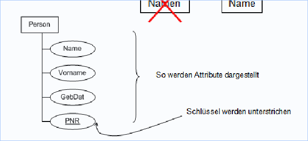

# Einführung

## Historische Entwicklung
* 1960/1970er Jahren - Daten nur in Dateien zu verwalten ist schwierig. Programmierer mussten immer dieselben Aufgaben lösen, d.h. wurden `Datenbanksysteme` entwickelt
* 1990er Jahren - Auswertung von Datenbank ist mühsam, d.h. wurden `DataWarehouses und OLAP Lösungen` entwickelt
* 2000er Jahren - Immer mehr Daten, Aufkommen von `Big Data, KI/AI und Data Mining`

 ## Datenbanksysteme
Speichern `grosse Datenmengen effizient, widerspruchsfrei und dauerhaft`. Die Einbettung erfolgt hierbei in der `Three-Tier-Architektur`:
* Benutzeroberfläche (UI)
* Anwendungsschicht (Logik)
* Datenbanksystem (Daten)

Seit den 90er Jahren sind vorallem `objektrelationale DBMs` verbeitet. Seit 2010 gibt es jedoch auch `No-SQL Datenbanken`.

## Datenmodellierung
Tabellen können `Beziehungen zueinander haben, welche komplex werden können`. Bei vielen Tabellen geht so die Übersicht verloren.
Um diesem Umstand entgegenzuwirken, wurde eine grafische Veranschaulichung entwickelt, die `ER-Diagramme`.

### Entity-Set
Einzelne Entitäten sind Datensätze, auch bekannt als `Tupel`. Ein Entity-Set wird folgendermassen dargestellt

*Darstellung Entity-Set*

Die Beziehungen zwischen den Tabellen werden mithilfe eines `Rautezeichens` dargestellt.
Wichtig hierbei ist, dass die Namen `immer im Singular geschrieben werden`.

## Datenbank-Transaktion
Datenbanksysteme wickeln `Datenänderungen in Transaktionen ab`:
* Daten können Zusammenhänge haben und sollten daher zusammen also `zeitlich gebündelt ablaufen`
* Transaktionen können `aus einzelnen Schritten bestehen`
Eine Transaktion ist somit eine Folge von Anweisungen (SQL-Aufrufe), die eine DB von einem `konsistenten Zustand` in einen `anderen konsistenten Zstuand` überführt.
Ohne Transaktionen kommt es `bei parallelen Abläufen zu Problemen`.

## Programmierung von Datenbank-Anwendungen

Es gibt grundsätzlich drei verschiedene Arten wie die Programmierung und die Interatkion mit der Datenbank-Anwendung geschehen kann:
* Direkte Kommunikation mittels `SQL-Statements` - Proprietäre Lösung und Bindung an Produkt / Hersteller
* Aufrufe von Statements `innerhalb einer Programmiersprache` - Keine SQL-Syntaxprüfung
* Einsatz von `Advanced Programming Interfaces` wie ORM-Mapping

## NoSQL
NoSQL steht für `not-only SQL` und wird für `verteilte und strukturierte Datenspeicherung`, die aus Performancegründen häufig
auf `Eigenschaften klassischer Datenbanksysteme verzichtet` angewendet. Zu den Stärken von NoSQL zählen:
* Verteilung auf viele Server möglich
* Gleichzeitig hohe Datenanforderungen und häufige Änderungen an den Daten

Beispiele für NoSQL Datenbanken sind MongoDB, Google Big Table, Amazon Dynamo

## Big Data
Big Data ist aus folgenden Gründen entstanden:
* Billiger Verfügbarkeit von Vernetzung und Bandbreite
* Sensoren und mobile Geräte produzieren immer mehr Daten
* Immer bessere Leistung von Rechnern
* Immer schnellere und billigere Speicher
* Skalierung mittels Cloud-Computing

Die `Herausforderungen` sind hierbei die `vier Vs`:
* Volume (Datenmenge)
* Velocity (Geschwindigkeit mit welcher Daten zur Verfügung gestellt werden kann)
* Variety (Wie stark sich die Daten voneinander unterscheiden)
* Veracity (Glaubwürdigkeit)

### Aktivitäten für den Umgang mit Big-Data-Beständen
Die nachfolgenden Aktivitäten sind anhand der `drei F's charakterisierbar`:
* Fast - Technische Rahmenbedingungen sollen keine Zeitverzögerung bei der Ausführung verursachen
* Flexible - Akvititäten sollen leicht an sich ändernde Bedingungen anpassbar sein
* Focused - Möglichkeit zur flexiblen Extraktio nvon Daten auf Basis von Trial and Error

#### Track and Evaluate
* Prozesszustände erfassen, Korrekturen vornehmen etc.
* Herausforderung: Daten sind in Echtzeit (Ortsdaten etc.)

#### Search and Identify
* Herausfiltern von Objekten anhand von Merkmalen

#### Analyze
* Data-Mining mittels Regressionsverfahren, Clusteranalysen, Entscheidungsbäumen etc.

#### Predict and Project (Vorhersagen und Planen)
* Aufgrund der vorhergehenden Schritte Geschäfts- und Fertigungsprozesse optimieren

### Gebrauchsformen von Big Data
* Information Retrieval - Direktes Auffinden von Datenobjekten
* Data Analysis - Reports erstellen aufgrund der vorhandenen und aggregierten Geschäftskennzahlen
* Data Mining and Machine Learning - Suche nach `potenziell interessanten Mustern, Auffälligkeit etc.` Wenn `klare Zielgaben vorhanden sind`, sprich man von `Machine Learning`
* Process Mining - Data Mining in Transaktionsdaten (Log Dateien etc.)
* Spam Erkennung
* Bild- und Handschriftenerkennung

### Entwicklungsprobleme von Big Data
* Unterschiedliche Schnittstellen, d.h. wenig Kompatibilität
* Unterschiedliche Modelle
* Viele Systeme berücksichtigen nur eines der 4 V's

## Datengewinnung und Datenqualität
Eine Datenanalyse wird häufig in separaten Systemen realisiert. Hierzu müssen die Daten `mittels ETL (Extract, Transform, Load) Prozesse` entsprechend aufbereitet und in ein `Data-Warehouse` gespeichert werden.
Wird hingegen auf den ETL Prozess verzichtet und `direkt in den operativen Quelldaten analysiert`, spricht man von `Data Lakes`

## Data Cleaning
* Datensätze können fehlerhaft sein - falsches Format, Ausreisser etc.
* Daten müssen aus Datenschutzgründen `anonymisiert werden`

## Aspekte der Datenqualität
* Aktualität der Daten
* Transparenz (Glaubwürdigkeit, Rückverfolgung ,Verifizierbarkeit)
* Vollständigkeit
* Konsistenz und Datenintegrität (innere Wiederspruchsfreiheit der Daten)

### Entitätsintegration
Daten zu `ein und demselben Objekt` sollen aus `verschiedenen Quellen gefunden und zusammengeführt` werden.

### Datenherkunft und Abstammung
* Nachvollziehbarkeit von Fehlern muss durch metadaten über die Herkunft der Daten nachvollziehbar bleiben

### Prozess und Workflowmanagement
Komplexe Analysen und Transformationen müssen entsprechend beschrieben werden. Dies kann mittels `Beschreibungssprachen wie BPMN` erfolgen.

### Metadaten-Management
* Genaue grammatikalische Beschreibung der Daten
* Dokumentieren der Datenherkunft um `juristische Risiken zu minimieren`
* Beschreibung der `ETL- und Cleaning-Prozesse` um diese später reproduzierbar zu machen

## Datenqualität nach ISO8000
Beschreibt `Mitarbeiter`, `Prozesse` und `Verbesserungsmassnahmen`

