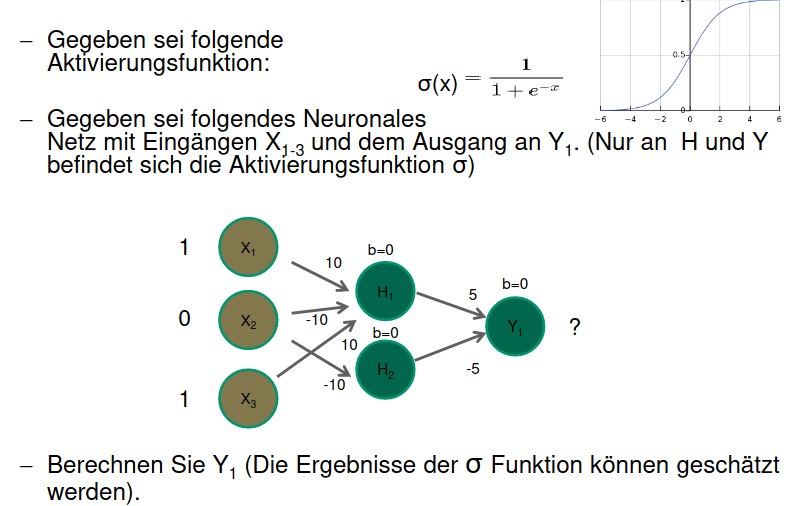

# Mögliche Aufgaben

## Dokumentenmanagement
* Gegeben sind 1000 Dokumente
* Jedes Dokument hat 100 Worte
* Term T1: "Gott" kommt in 10% der Dokumente vor. In Dokument Di sogar 10 mal
* Term T2: "Chur" kommt nur in einem Dokument Di und zwar nur einmal vor
* Berechnen Sie die Termgewichte für T1 und T2 in Dokument Di

### Formeln

\\[
Termgewicht (TFIDF) = TF * IDF
\\]

\\[
IDF = \frac{Alle Dokumente}{Dokumente welche einen bestimmten Term beinhalten}
\\]

TF (Termfrequenz) = Wie oft ein Wort im Verhältnis zu allen Wörtern im Dokument vorkommt

### Berechnung

\\[
TF_{T1} = \frac{10}{100} = 0.1
\\]

\\[
TF_{T2} = \frac{1}{100} = 0.01
\\]

\\[
IDF_{T1} = \frac{1000}{100} = 10
\\]

\\[
IDF_{T2} = \frac{1000}{1} = 1000
\\]

\\[
TFIDF_{T1} = TF_{T1} * IDF_{T1} = 0.1 * 10 = 1
\\]

\\[
TFIDF_{T2} = TF_{T2} * IDF_{T2} = 0.01 * 1000 = 10
\\]

## Neuronale Netze

### Formeln
Bei neuronalen Netzen beeinflusst `jede Eingabe X jede Ausgabe Y mit einem bestimmten Faktor W`:

\\[
y_1 = x_1 * w_1 + x_2 * w_2 + b_1
\\]

Wichtig: `Die Sigmoid Funktion macht negative Werte zu 0 und positive Werte zu 1`

### Berechnung Y1
\\[
H_1 = \sigma(X_1 * 10 + X_2 * -10 + X_3 * 10 + 0) = \sigma(1 * 10 + 0 * -10 + 1 * 10 + 0) \approx 1
\\]

\\[
H_2 = \sigma(X_2 * -10 + 0) = \sigma(0 * -10 + 0) \approx 0
\\]

\\[
Y_1 = \sigma(H_1 * 5 + H_2 * -5 + 0) = \sigma(1 * 5 + 0 * -5 + 0) \approx 1
\\]

## Fragen
> Jemand gibt Ihnen Daten von Eurotax-Schweiz, aus einem Online-Vermittlungssystem für Kraftfahrzeuge. Für bestimmte Motorräder sollen Sie ein Preismodell in Abhängigkeit vom Alter und vom Kilometerstand machen. Was für eine Art Machine-Learning-Problem ist das?

Dies ist ein Fall für eine `Regression`

> Ein Datensatz Kunden soll für das Marketing aufbereitet werden. Man weiss aus den Daten, wer in den letzten Jahren, was verkauft hat. Empfehlen Sie ein Verfahren, mit dem man hohe Umsätze in betimmten Bereichen vorhersagen kann.

Man kann `Supervised Learning einsetzen`, zum beispiel über eine `Regressionsanalyse`

> Daten, die Sie analysieren oder für Data-Mining verwenden wollen, liegen auf einem Datenbanksystem und auf einem Excel-Sheet. Beschreiben Sie einen möglichen Weg, den die Daten bis in Tools für das Machine-Learning nehmen könnten und welche Zwischenschritte hierfür eventuell notwendig sind.

Grundsätzlich ist hierfür ein `ETL (Extract, Transform, Load)` Prozess notnwendig:
* Daten aus Datenbank extrahieren mittels Query Befehle > Abspeicherung im CSV Format
* Daten aus dem Excel Sheet extrahieren und Abspeicherung im CSV Format
* Daten auf Inkosistenzen prüfen und gegebenfalls bereinigen und vereinheitlichen
* Relevante Daten heraussuchen für das Machine Learning
* Einen Teil der Daten als Trainingsdaten nutzen und das Modell trainieren
* Trainiertes Modell mit den restlichen Daten testen

> In der Stadt Ulm treten seit September gehäuft Krankheitsfälle mit Legionellen auf. Man kann hierzu so viel verraten: Verdächtig sind Klimaanlagen auf Hausdächern. Beschreiben Sie eine grafische Methode, wie man die Quelle eingrenzen kann, um Sie zu finden.

Ein einfaches `Koordinatensystem` würde hier wahrscheinlich schon genügen. Man könnte "Kreuze" setzen und so die Gefahrenquelle eingrenzen.

> Jemand behauptet, dass ein Regressionsmodell, dass die gegebenen Beispieldaten möglichst gut vorhersagt, für zukünftige Daten aus derselben Quelle, auch bestens vorhersagen wird. Was antworten Sie?

Dies kommt darauf an ob evtl. Under oder Overfitting beim Regressionsmodell vorhanden sind. Es könnte sein dass das Regressionsmodell exakt für den Datensatz sehr gut funktioniert und für zukünftige Daten aber fehlschlägt.

> Warum ist das menschliche Gehirn immer noch dem Machine-Learning überlegen?

Weil menschliche Gehirne sich besser dynamisch anpassen und adaptieren können.

> Warum wurden mehrschichtige Neuronale Netze erfunden?

Um das XOR Problem zu lösen

> Wo sind die Grenzen bei Deep-Learning in der Bildverarbeitung?

Bei der Bilderkennung stossen die Modelle schnell an ihre Grenzen.

