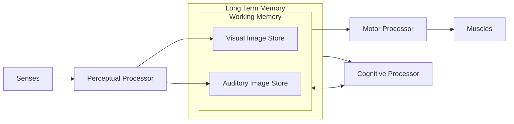
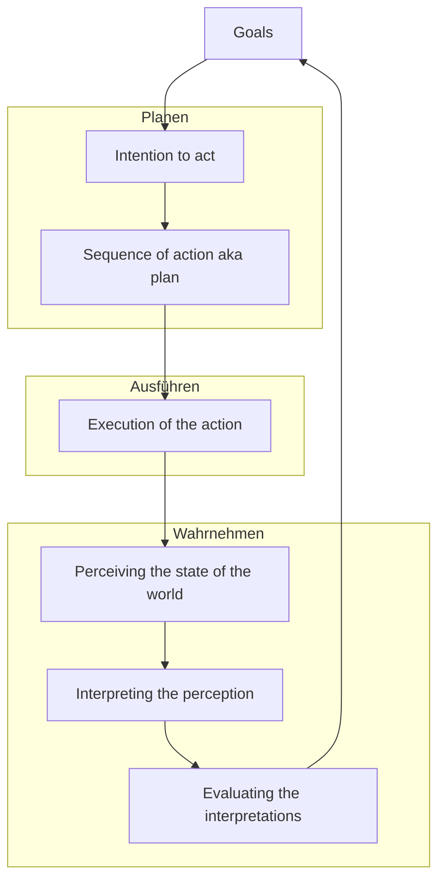

# Forschungsgebiete von HCI
Ein wichtiger Bestand von HCI ist der Mensch selbst. Der Mensch kann in abstrakter Weise mit dem Model Human Processor Modell beschrieben werden.

## Human Processor Model
Das Human Processor Model besagt, dass ein Nutzer die Sinneseindrücke mithilfe eines **Perceptual Processors** verarbeitet und diese dann in zwei unterschiedliche "Speicher" ablegt.
Zum einen gibt es den **Visual Image Store**, in welchem Dinge abgespeichert werden, welche wir **sehen**. Zum Anderen gibt es den **Auditory Image Store**, in welchem Dinge abgespeichert werden, welche wir **hören**.
Diese zwei Speicher sind Bereiche des "Working Memory". Mit genug Übung etc. gehen diese in das "Long Term Memory" über.
Zudem besteht eine Verbindung zum "Motor Processor" und zum "Cognitive Processor".

*Human Processor Model*

## Seven Stages of Action
Die Seven Stages of Action beschäftigen sich primär mit *drei Hauptfragen**:
* Wie kann man den Nutzer dabei unterstützen, die nächste Interaktion zu **planen**?
* Wie kann man den Nutzer dabei unterstützen, die nächste Interatktion **auszuführen**?.
* Wie kann man den Nutzer dabei unterstützen, den Zustand des Systems **richtig wahrzunehmen**?

## Seven Stages of Action

 *Seven Stages of Action*