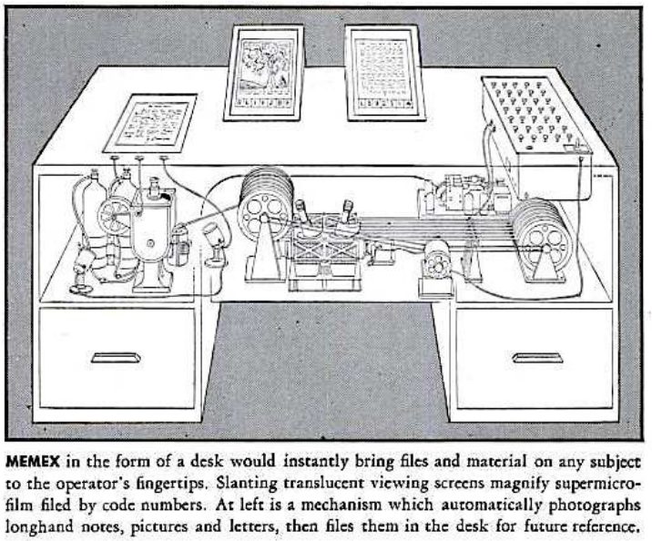
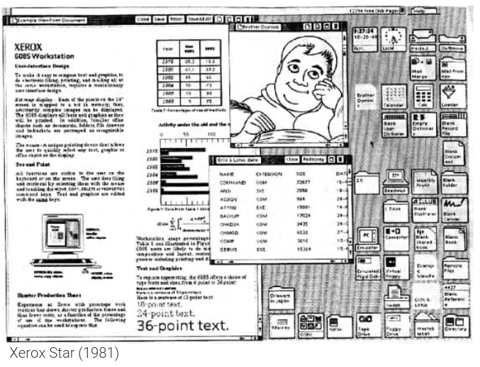
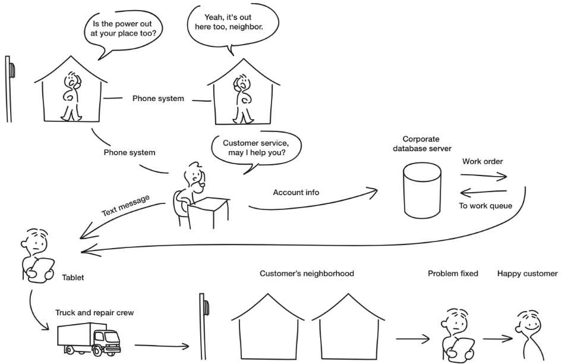

# Geschichte von HCI
Die Geschichte von HCI kann in **vier Bereiche** eingeteilt werden.

## Mainframe Ära
Die Mainframe Ära spielt in den **1960er Jahren**. Zu dieser Zeit war es üblich, dass **ein Computer mit mehreren Personen** genutzt wurde.
Einige wichtige Vertreter dieser Ära sind:
* ZUSE Z4 (1945)
* Fortran auf Lochkarten

In Bezug auf interaktive Systeme gab es ebenfalls ein paar nennenswerte Erfindungen.

## Personal Computer Ära
Die Personal Computer Ära spielt in den **1980er Jahren**. Hier war es üblich dass **ein Computer pro Nuzter** zur Verfügung stand.

### Memex (1945)
Die Idee hinter Memex ist es einen Schreibtisch zu haben, welcher alle für den Nutzer notwendigen Informationen sofort zur Verfügung stellt. Dies entspricht als Metapher gedacht dem Desktop auf dem Computer.

*Memex*

### Sketchpad (1963)
Eines der ersten Sketchpad's wurde von Ivan Shuterland am MIT entwickelt und beinhaltete nebst dem eigentlichen Eingabestift folgende Möglichkeiten:
* Grafische Benutzeroberfläche
* GUI Editor mit Stylus
* Zooming
* Snap-to-Grid
* Copy, Paste & Templates

### NLS (1968)
NLS (on-Line Systems) wurde erstmals von Douglas Engelbart im Rahmen einer Präsentation an der Standford University vorgestellt. Hierbei handelt es sich um eine Demo welche unter anderem folgende Dinge erstmalig vorgestellt hat:
* Maus und Mausbedienung
* Menu und Anwendungsfenster
* Keyboard und Textverarbeitung

### Command Line
Zu Beginn gab es keine intuitiven Benutzeroberflächen, die meisten Befehle mussten per Hand in ein Terminal (Command Line) eingegeben werden. Dies erforderte teilweise Programmiererfahrung und konnte daher nicht von jedermann genutzt werden.
Abhilfe hierbei schaffte `XEROX Parc`

### XEROX Star
Das erste Konzept des heute bekannten GUI (Graphical User Interface) wurde 1981 von XEROX Parc entwickelt und ist unter dem Namen XEROX Star bekannt.

*XEROX Star*

### Apple Lisa (1983)
Der Apple Lisa gilt als einer der ersten Personal Computer, welcher eine grafische Benutzeroberfläche sowie über Keyboard und Maus verfügte.

## Mobility Ära
Die Mobility Ära spielt in den **2000er Jahren**. Hier war es üblich, dass **pro Person mehrere Computer** genutzt wurden.

### Personal Digital Assistant (PDA)
Der PDA bezeichnet einen Rechner im Hosentaschenformat und einem Eingabestift. Die Bedienung erfolgte hierbei über ein LCD Display. Der PDA, auch Electronical Organizer genannt, gieng aus dem programmierbaren Taschenrechner hervor.

### Interactive Surfaces
Geräte mit einer interagierbaren Oberfläche sind:
* Microsoft Surface
* iPad / iPhone

## Ubiquity Ära
Die Ubiquity Ära spielt ab dem Jahr **2020**. Die Idee hierbei ist, dass es **pro Person mehrere tausende Computer** gibt, in Form von Smartphones, Smartwatches etc.
Ein zentrales Merkmal der Ubiquity Ära ist das **Ubiquitous Computing**. Ubiquitous Computing unterteilt die Computer in drei verschiedene Formfaktoren.

### Boards (1m)
Unter Boards werden Displays mit einer Grösse rund 1m verstanden.

### Pads (0.1m)
Unter Pads werden Displays mit rund 0.1m Durchmesser verstanden.

### Tabs (1cm)
Unter Tabs werden Displays mit rund 1cm Durchmesser verstanden.

## Themengebiete von Ubiquitous Computing
Ubiquitous Computing umfasst eine Vielzahl von verschiedenen Themengebieten, unter anderem:
* Smart Devices
* Natural User Interfaces
* Internet of Things

## Verschiedene Arten von Interaktionsmöglichkeiten und UX

### Localized Interaction
Hierbei werden einfache Interaktionen mit **einem Gerät** aus einer bekannten Umgebung des Nutzers verstanden.
Die Interatkion ist dabei **aufgabenbasiert**, **zeitlich limitiert** und auf eine **kurze Zeit** begrenzt.
Beispiele für localized Interactions sind:
* Das Prüfen von E-Mails am Computer
* Geld von einem Bankautomaten holen

Das Design folgt hierbei der Interaktion.

### Activity-based Interaction
Ist ein Weg um Interaktionen zu beschreiben, welche über **einfache Tätigkeiten** hinausgehen. Eine Aktivität beschreibt hierbei eine **Sequenz von Aufgaben**, welche ebenfalls **parallel** oder **überlappend** sein können.
Kurzum kann eine Activity-based Interaction folgende Elemente umfassen:
* Interaktion mit einem Gerät um verschiedene zusammenhängende Tasks zu erledigen
* Interaktion mit mehreren Geräten

### System-spanning Interaction
System-spanning Interaction ist eine **Art von Activity-based Interaction** welche **mehrere Personen, Rollen und Standorte umfasst**.

*System spanning Interaction*

### Pervasive Information Architecture
Die durchdringende Informationsarchitektur (auch Pervasive Information Architecture) ist eine Informationsschicht, welche sämtliche Kanäle und Nutzer zusammen verbindet.
Sie bestimmt somit wie Nutzer Informationen **sehen, verändern und miteinander teilen**.

### Single channel information design
Umfasst einen **einzigen Kanal** (Desktop, Laptop etc.). Heutzutage wird jedoch über viele verschiedene Kanäle kommuniziert.

### Cross-channel Information design
Umfasst **mehrere Geräte, Nutzer und Plattformen**. Jeder Kanal befasst sich jedoch mit dem gleichen Nutzer und den gleichen Informationen.
Cross-channel Information design ist der Vorläufer von Ubiquitous Computing und Embedded interaction.

