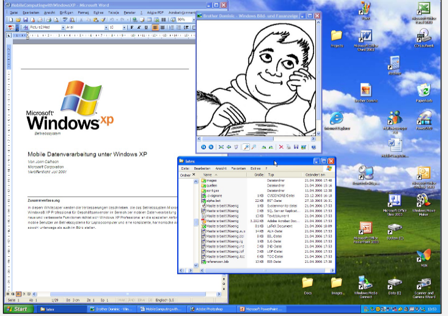

# Human Computer Interaction
Human Computer Interaction (HCI) ist eine Disziplin, welche sich mit dem **entwickeln**, **evaluieren** und der **Implementierung** von interaktiven Systemen befasst. Als Grundlage dabei dient die Beobachtung des Umfelds.
Wichtig an dieser Stelle zu erwähnen ist es, dass diese verschiedenen Diszipline sich in einem wiederholenden Entwicklungsprozess (User Centered Design Prozess, etc.) befinden.
HCI besteht aus einer Vielzahl von unterschiedlichen Disziplinen:
* Design
* Psychologie
* Engineering
* Computer Science

## Definitionserklärungen

### Definition Usability
> Usability definiert, wie einfach ein bestimmtes Produkt innerhalb eines **Nutzungskontextes** genutzt werden kann um **einfach**, **effizient** und **zufriedenstellend** die Ziele des Nutzers zu erreichen.

### Definition Nutzungskontext
> Beschreibt die physische und soziale Umgebung, in welcher ein Produkt verwendet wird.
> *Ist das Produkt für die Umgebung geeignet, in der es verwendet wird?*

### Definition Effektivität
> Genauigkeit und Vollständigkeit unter welchem der Nutzer das Ziel mit Hilfe des Computers erreichen kann. *Beispielsweise der Grad der Zielerreichung in Prozent*

### Definition Effizienz
> Aufwand mit welchem der Nutzer ein bestimmtes Ziel erreicht. *Beispielsweise die Tastenanschläge pro Minute*

### Definition Zufriedenstellung
> Freiheit von Beeinträchtigung und positive Einstellung gegenüber der Nutzung des Produktes.

### Definition User Experience
> Reaktion, Emotionen und Wahrnehmungen des Nutzers bei der Interaktion mit dem Produkt **vor**, **während** und **nach** der Nutzung.

### WIMP
> WIMP steht für Windows, Menus, Icons and Pointers in Bezug auf die Desktop Metapher

### Desktop Metapher
Die Desktop Metapher stellt im Gegensatz zur Kommandzeile ein neuer Ansatz zur Interaktion mit dem Computer dar:
* Direkte visuelle Manipulation von Objekten
* Sichtbarkeit von Objekten und Aktionen
* Schnelle, umkehrbare Aktionen

*XEROX Star 1981*

#### Vorteile im Gegensatz zur Kommandozeile
* Schnelles Erlernen und Wiedererinnern
* Fehleranfälligkeit durch Syntax wird vermieden
* Fördert exploratives Erforschen

#### Nachteile im Gegensatz zur Kommandozeile
* Teilweise geringere Effizienz
* Teilweise reduzierte Funktionen

### Definition Natural User Interfaces
> Umfasst alle Interaktionsformen, welche über WIMP hinausgehen und sich an den sensor motorischen Fähigkeiten des Menschen orientieren. Mit natürlich ist hierbei eine **natürliche Eingabeform** sowie eine **selbsterklärende Bedienung** gemeint. 

### Definition Ubiquitous Computing
> Unter Ubiquitous Computing wird verstanden, dass der Computer **allgegenwärtig und in unser Umfeld nahezu unsichtbar integriert ist**.

### Gulf of Execution
> Kluft zwischen den beabsichtigten Handlungen und den möglichen Aktionen.

### Gulf of Evaluation
> Kluft zwischen den Ausgaben des Systems und der korrekten Interpretation

### Irrtümer (Mistakes)
> Falsche Handlungen zum Erreichen des Ziels.

### Fehlleistungen (Slips)
> Richtige Handlung falsch ausgeführt

### Multimodale Interaktion
> Multimodale Interaktion kombiniert **zwei oder mehr** Input Modi (beispielsweise Touch und Speech) miteinander.

### Input Device State
> Gibt an, in welchem Zustand die Input Geräte sind. Im Falle eines Button hat dieser beispielsweise die Zustände **gedrückt** sowie **nicht gedrückt**.

### Interaktionsstyle
> Grundsätzlich kann zwischen **zwei verschiedenen** Interaktionsstilen unterschieden werden. Dies ist zum Einen die Interaktion per Kommando via Kommandozeile und zum Anderen die Interaktion mittels Dialogen (GUIs).

### DMI
> Unter DMI wird Direkte Manipulation verstanden. Bei einem klassichen GUI wäre dies über Tastatur, Bildschirm und Maus, wobei Input und Output getrennt sind. Bei Smartphones hingegen ist der Input und Output direkt miteinander verbunden und wird via Touch oder Pen ermöglicht. 

### User-Centered Design Process
> Der User-Centered Design Prozess bezweckt Produkte und Dienstleistungen zu entwickeln, welche **reale Bedürfnisse der Nutzer adressieren**.

### Menschenzentriert
> Menschenzentriert bedeutet, den Menschen **kontinuierlich** in den Prozess miteinzubeziehen.

### User Experience Design
> User Experience Design bietet einen **systematischen, wissenschaftlich fundierten Ansatz**, mit dem die **Gebrauchstauglichkeit eines Produktes sichergestellt werden kann**.

### Buxton's Law
> Buxton's Law besagt, dass der Mensch nur eine eingeschränkte kognitive Fähigkeit besitzt (Human Capacity). Der Mensch kann beispielsweise Kunden beraten, wenn er jedoch noch eine komplizierte Software bedienen muss, **welche seine kognitiven Fähigkeiten übersteigt**, funktioniert dies nicht.

### Wireflows
> Wireflows sind ein Designspezifikationsformat dass `Wireframes` mit einem `Ablaufdiagramm` kombiniert um `Interatkion darzustellen`.

### Wireframes
> Wireframes sind eine `vereinfachte Darstellung einer Benutzerschnittstelle` und zeigen das `Layout in Form eines Drahtgerüstes` auf.

### Prototyp
> Ein Prototyp ist ein `funktionsfähiges aber vereinfachtes Produkt` für einen `bestimmten Zweck`. Es kann dabei rein `äusserlich oder technisch` dem Endprodukt entsprechend. 

### User Experience Evaluation
> Ist die Bewertung der User Experience einer Lösung in `Hinblick daruaf, wie gut sie die Benutzer unterstützt um ihre Ziele zu erreichen`

### Qualitative Studien
> Liefern Daten über `Verhaltensweisen oder Einstellungen` auf Grundlage `direkter Beobachtung`. Sind gut geeignet um zu beantworten `warum oder wie ein Problem zu lösen ist`.

### Quantitative Studien
> Daten über Verhalten oder Einstellung werden `indirekt über eine Messung` erhoben. Beantwortet die Frage nach dem `Wieviel`.

### Natural Produktverwendung
> Natürliche oder naturnahe Verwendung des Produktes. Kann über `Field Studies ermittelt werden`.

### Scripted Produktverwendung
> Gezielte Nutzung des Produktes. Kann über `Usability Studies ermittelt werden`.

### Limited Produktverwendung
> Begrenze Nutzung um einen `bestimmten Aspekt der Benutzererfahrung zu untersuchen` Kann über `Card Sorting ermittelt werden`

### Decontextualized Produktverwendung
> Keine Verwendung `des Produktes während der Studie`. Kann über eine `Survey ermittelt werden`.

### Externe Validität
> Ist das Testen des Produktes im `echten Umfeld, d.h. im Feld draussen`

### Interne Validität
> Ist das Testen des Produktes in einer `sicheren und kontrollierten Umgebung, d.h. im Labor`

