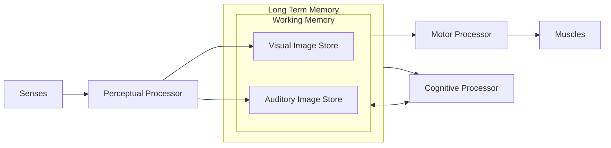
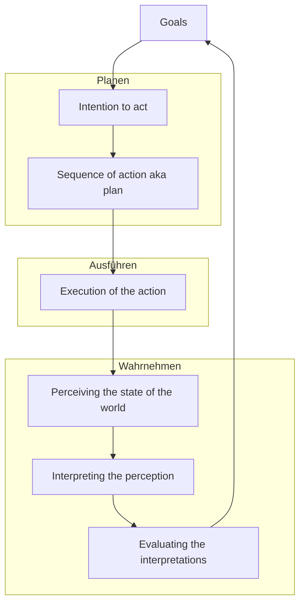

# Mermaid Diagrams

## Human Processor Model

```mermaid
flowchart LR
    subgraph long_term_memory[Long Term Memory]
    subgraph working_memory[Working Memory]
    visual_image_store[Visual Image Store]
    auditory_image_store[Auditory Image Store]
    end
    end
    motor_processor-->muscles[Muscles]
    working_memory-->motor_processor[Motor Processor]
    long_term_memory-->cognitive_processor
    cognitive_processor[Cognitive Processor]<-->working_memory
    perceptual_processor[Perceptual Processor]-->visual_image_store & auditory_image_store
    senses[Senses]-->perceptual_processor
```

## Seven Stages of Action

```mermaid
flowchart TB
   goals[Goals]
   subgraph plan[Planen]
   intention_to_act[Intention to act]
   sequence_of_action[Sequence of action aka plan]
   end
   subgraph execute[Ausführen]
   execution_of_action[Execution of the action]
   end
   subgraph perceive[Wahrnehmen]
   perceiving_the_state[Perceiving the state of the world]
   interpreting_the_perception[Interpreting the perception]
   evaluating_the_interpretations[Evaluating the interpretations]
   end
   goals-->intention_to_act-->sequence_of_action-->execution_of_action-->perceiving_the_state-->interpreting_the_perception-->evaluating_the_interpretations
   evaluating_the_interpretations-->goals
```
  
