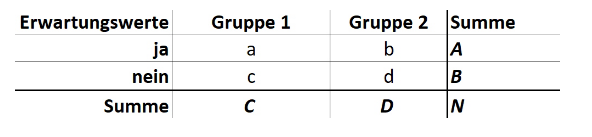

# Formeln

## Relative Häufigkeit
\\[
\\%k = \frac{fk}{n}*100\\%
\\]

## Gültige Prozentwerte bei Häufigkeiten
fk = Absolute Häufigkeit

nv = Gültige Anzahl an Werten
\\[
\\%kv = \frac{fk}{nv}*100\\%
\\]

## Winkel eines Kreisauschnittes berechnen
\\[
\\gamma k = \frac{\\%k * 360\circ}{100\\%}
\\]

## Medianwert oder Zentralwert
* Ist derjenige Wert `unter und über dem gleichviele Fälle liegen`
* Ist `unempfindlich gegenüber Ausreissern`
* Wird ab `Ordinalskalenniveau verwendet`

### Berechnung für `ungerade Anzahl N`
\\[
Md = x[\frac{N + 1}{2}] 
\\]

### Berechnung für `gerade Anzahl N`
\\[
Md = \frac{x[\frac{N}{2}] + x[\frac{N}{2} + 1]}{2} 
\\]

## Arithmetischs Mittel
* Bekanntes Mass der zentralen Tendenz
* Darf nur `bei metrischem Skalenniveau berechnet werden`
* Anfällig gegenüber Ausreissern

\\[
x = \frac{(x1 + x2 + x3 + ... + xn)}{n}
\\]

## Gewichtetes arithmetische Mittel
* Wird bei `primären Häufigkeitstabellen verwendet`

K = Anzahl der unterschiedlichen Kategorien

n = Anzahl der gültigen Fälle

fk = Häufigkeit in der Kategorie k

\\[
x = \frac{1}{n}\sum_{k=1} fk * k
\\]

## Arithmetischer Mittelwert bei sekundären Häufigkeitstabellen
Lässt sich nur ungefähr berechnen, da bei `der Intervallbildung bereits Informationen verloren gehen`.

K = Anzahl der Intervalle
Mk = Mittelpunkt des Intervalls k
fk = Anzahl Fälle im Intervall k

\\[
\bar{x} \approx \frac{1}{n} \sum_{k=1} fk* Mk
\\]

Hieraus kann auch wieder n abgeleitet werden:

\\[
\sum_{k=1}fk = n
\\]

## Modalwert
* Wird bei `Nominalskalen` verwendet 
* Hat aber in der Forschung `keine praktische Bedeutung`, da er nur den `häufigsten Wert beschreibt und die Umgebung ausser Acht lässt`.

## Spannweite / Variationsbreite
* Ist die Differenz wischen dem kleinsten und dem grössten Wert
* Gibt Auskunft über die Verteilung zwischen den Extremwerten
* Ist anfällig für Ausreisser

\\[
R = x_{max} - x_{min}
\\]

## Quartilabstand
* `Geordnete Messwertreihe` wird in `vier gleich grosse Teile` aufgeteilt (Q1 - Q4)
* Zwischen den Quantilen Q3 und Q1 iegen `50% der Fälle`

\\[
QA = Q_3 - Q_1
\\]

## Varianz
* Berechnet sich `aus allen Einzelwerten und Beschreibt somit die gesamte Variabilität der Werte`
* Die Varianz ist die Summe der Abweichungsquadrate vom Mittelwert dividiert durch die Anzahl der Fälle

\\[
s^2 = \frac{1}{n} \sum_{i=1}(xi-\\bar{x})^2
\\]

## Standardabweichung
* Berechnet sich aus der Wurzel der Varianz
* Es resultiert eine Grösse in der Ursprünglichen Einheit

\\[
s = \sqrt{s^2} = \sqrt{\frac{1}{n} \sum_{i=1} (xi - \bar{x})^2}
\\]

## Z-Wert
* Damit kann beurteilt werden, wo in der `Verteilung die Werte liegen`

\\[
z = \frac{x - \bar{x}}{s}
\\]

## Itemschwierigkeit
Pi beschreibt die Itemschwierigkeit, d.h. Pi = 0 bedeutet, dass keine Person die Aufgabe lösen konnte
* Eine Faustregel ist, dass die `Schwierigkeit der Items zwischen 20 und 80 liegen sollte`

\\[
P_i = \frac{\bar{x}_i - min(x_i)}{max(x_i) - min(x_i)} * 100 
\\]

### Wenn Minimumwert = 0
\\[
P_i = \frac{\bar{x}_i}{max(x_i)} * 100
\\]

## Reliabilität
\\[
r_{tt} = \frac{\sigma^2(x) - \sigma^2(\epsilon)}{\sigma^2(x)}
\\]

## Standardfehler
\\[
\sigma_{\bar{x}} = \sqrt{\frac{\sigma^2}{n}}
\\]

Anders umgeformt ergibt sich für den Standardfehler

\\[
SE = \frac{s}{\sqrt{n}}
\\]

### Ermittlung Populationsvarianz (falls nicht bekannt)
\\[
\sigma^2 = \frac{s^2n}{n-1}
\\]

## Konfidenzintervall
Standardfehler muss mit dem z-Wert der Grenze multipliziert werden.
Beispiel 90% Intervall (pro Seite entfallen dann jeweils 5% der Stichprobenmittelwerte):

\\[
Links = (-z_{90\\%} \sigma\bar{x})
\\]

\\[
Rechts = (+z_{90\\%} \sigma\bar{x})
\\]

## Anzahl Gruppenvergleiche

K = Anzahl der Kategorien des Prädikators

\\[
\frac{1}{2}K^2 - \frac{1}{2}K
\\]

Beispiel: Überprüfung ob sich die Leistung von Maturanden in der Basisprüfung in 62 Kantonsschulen unterscheidet:

\\[
\frac{1}{2}62^2 - \frac{1}{2}62 = 1891
\\]

## Mean Square berechnen (Tukey Test)
Sum of Squares (SS) dividiert durch Anzahl Freiheitsgrade (df) 

## Relative Position
\\[
\sum_{i=1}(x_i - \mu_x)(y_i - \mu_y)
\\]

## Geradengleichung

b0 = Achsenabschnitt (Schnittpunkt der Gerade mit Y-Achse)

b1 = Steigung der Geraden

\\[
Y = b_0 + b_1X
\\]

## Kleinste Quadrate
Die Grundformel für die Methode der kleinsten Quadrate ist:
\\[
\sum e_i = \sum (y_i - \bar{y_i})
\\]

Ersetzt man jedoch \\( \bar{y_i}\\) durch die Geradengleichung erhält man eine neue Formel. Die Formel bekommt ihren Namen, weil `nicht die Abweichungen sondern die quadrierten Abweichungen minimiert werden`.

\\[
\sum e_i^2 = \sum (y_i - (b_0 + b_1*x_i))^2 = min 
\\]

## Standardisierte Z-Werte

\\[
\beta_i = b_i \frac{s_{xi}}{s_y}
\\]

## Bestimmheitsmasse \\( R^2\))

SSreg = Sum of Squares of Regression

SStot = Sum of Squares total

\\[
R^2 = \frac{SS_{reg}}{SS_{tot}}
\\]

## Effekgrösse
* 0.2 = kleiner Effekt
* 0.5 = mittlerer Effekt
* 0.8 = grosser Effekt

\\[
\epsilon = \frac{\bar{x}_A - \bar{x}_B}{s}
\\]

## Chi-Quadrat
Bei einem Chi-Quadrat Test ist die Grundlage eine `Vierfeldertafel`

\\[
\chi^2 = \frac{N(ad - bc)^2}{ABCD}
\\]

Wichtig die `Anzahl der Freiheitsgrade hängt davon ab wie viele Zellen frei varriieren können`
Der kritische Wert kann aus der Tabelle abgelesen werden mit alpha Wert von 5% und der Anzahl der Freiheitsgrade.
