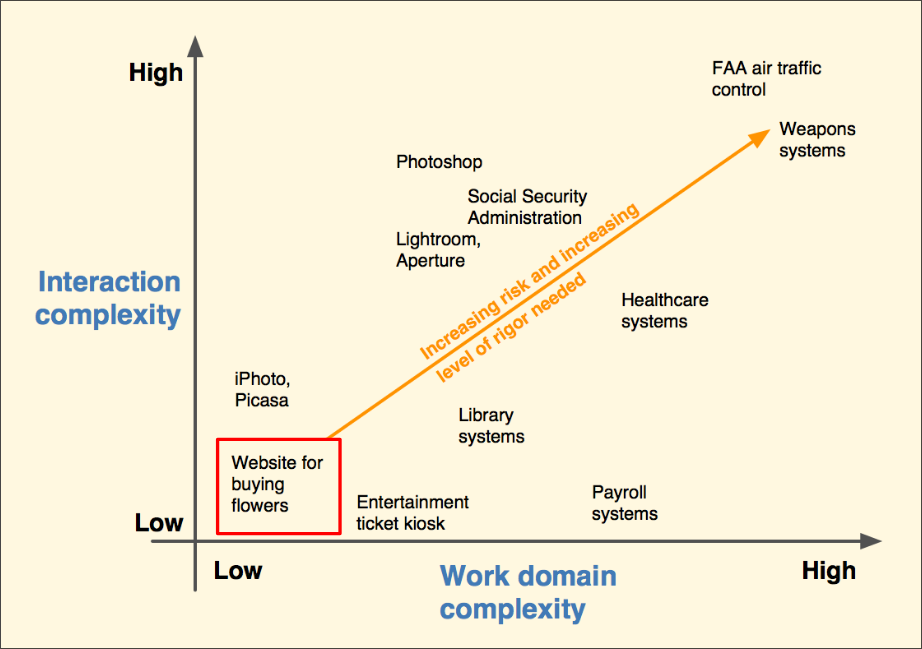

# Systemkomplexität und Projekt Parameter
Um die Systemkomplexität und das Projekt richtig einschätzen zu können, ist im Vorfeld eine `Anforderungesanalyse` notwendig. Bei der Anforderungsanalyse ist es wichtig dass `der Mensch und seine Bedürfnisse im Mittelpunkt steht`.

## Erfassung der Systemkomplexität
Die Systemkomplexität kann in  vier Quadranten unterteilt werden:
* Einfache Interaktionskomplexität und einfache Domäne (`unterer linker Bereich`) Beispiele hierfür sind `Webseiten für Blumengeschäfte`
* Hohe Interaktionskomplexität und anspruchsvolle Domäne (`oberer rechter Bereich`) Beispiele hierfür sind `Flugsysteme`
* Hohe Interaktionskomplexität und einfache Domäne (`oberer linker Bereich`) Beispiele hierfür sind `Itunes, Digital Watches etc.`
* Einfache Interaktionskomplexität und anspruchsvolle Domäne (`unterer linker Bereich`) Beispiele hierfür sind `Steuersoftware`

*System Komplexität*

## Handhabung von Projekt Parametern
Jedes Projekt hat gewisse Vorgaben bzw. Parameter. Die Kunst besteht darin, diese Projekt Parameter wie `Projekt Risiken`, `Projekt Ziele` etc. den geeigneten `UX Methoden` zuzuordne den geeigneten `UX Methoden` zuzuordnen. Folgende Dinge lassen sich hierbei steuern:
* Welche `Entwicklungsaktivitäten` getätigt werden müssen
* Welche `Methoden und Techniken` für das Erreichen der Projekt Parameter eingesetzt werden
* Die Anzahl der `notwendigen Iterationen`
