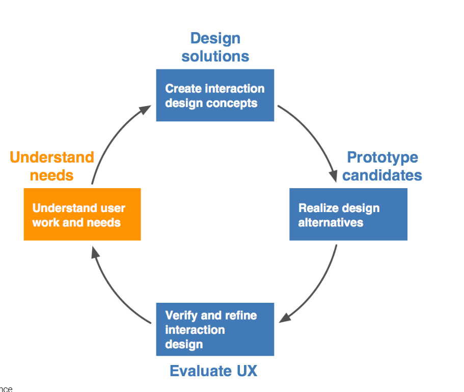

# Nutzerforschung
Bei der Nutzerforschung ist es essenziell den **Nutzungskontext zu verstehen**. Der Grundansatz in der Nutzerforschung lässt sich in drei Teile unterteilen:
* Den **Benutzer verstehen** und versuchen **die Dinge aus sicht des Nutzers** zu sehen.
* Die **Tätigkeiten** des Nutzers lernen sowie **verdeckte Abhängigkeiten und Prozesse** verstehen.
* Den **Nutzungskontext** kennen, lernen sowie verstehen

Die Nutzerforschung dient also dazu **Möglichkeiten für Verbesserungen / Neuerungen sowie Innovationen zu finden**.

## Tätigkeiten
Es ist von höchster Bedeutung, herauszufinden, **was Nutzer tun und wie sie es tun**. Hierzu gibt es verschiedene Möglichkeiten:
* Prozeduren und Vorgehensweise
* Routinen
* Konventionen
* Physische, manuelle und automatische Aktivitäten

## Kontext
Zudem ist es wichtig, herauszufinden, wie der Kontext das System beeinflusst. Hierbei muss sowohl die **physische, soziale und Organisationsumgebung** berücksichtigt werden.

## UX Research im Design Lifecycle

### Typen von UX Research
Grundsätzlich kann zwischen zwei verschiedenen Arten von UX Research unterschieden werden. Zum Einen gibt es **Generative** User Research. Dies umfasst die Phasen **Discover** und **Define**. Zum Anderen gibt es **Evaluative** Research mit den Phasen **Develop** und **Deliver**.
**Vor der eigentlichen Entwicklung** ist es hierbei wichtig, sich mit den **Bedürfnissen der Nutzer** auseinanderzusetzen und herauszufinden was funktioniert und was nicht. Hierzu können folgende Aktivitäten verwendet werden:
* Interviews
* Focus Groups
* User Interviews

**Während der Entwicklung** muss stetig überprüft werden, ob man **auf dem richtigen Weg ist** und ob **das richtige Produkt entwickelt wird**. Dies kann mit folgenden Aktivitäten erreicht werden:
* Card Sorting
* Tree Testing
* Prototype Testing

**Nach der Entwicklung** muss geprüft werden, wie gut die Ziele und die Nutzerbedürfnis abgedeckt worden sind:
* A/B Testing
* Diary Studies
* Moderiertes und unmoderiertes User Testing

### Design Lifecycle
Ziel des Design Lifecycles ist es, die **Domäne** zu verstehen. Hierzu wird oft im Vorfeld eine **Usage Research** betrieben (Contextual inquiry und Contextual analysis) sowie entsprechende User Stories und Anforderungen definiert.
Wichtig hierbei ist, dass der Design Lifecycle ein **sich wiederholender Prozess** ist.

*Design Lifecycle*
