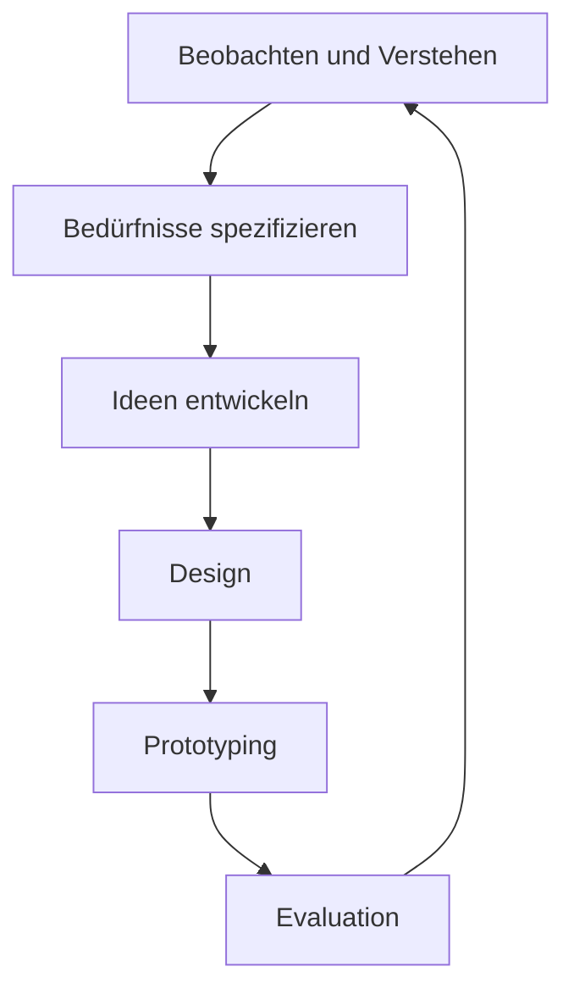
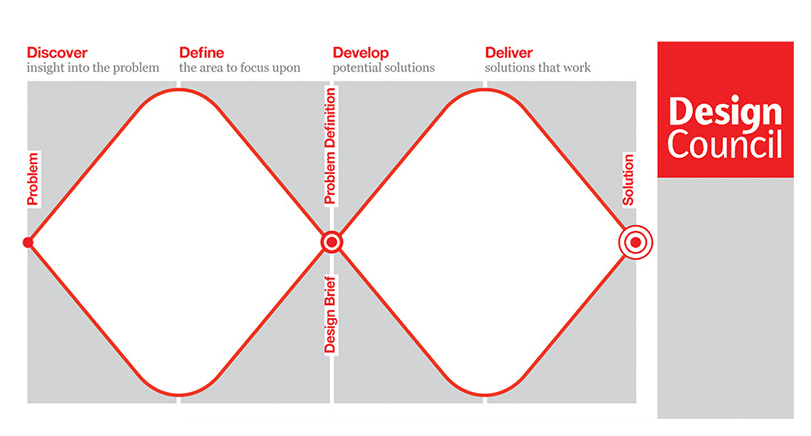
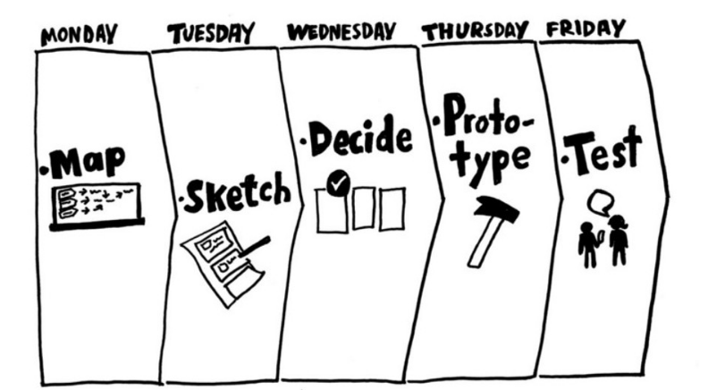
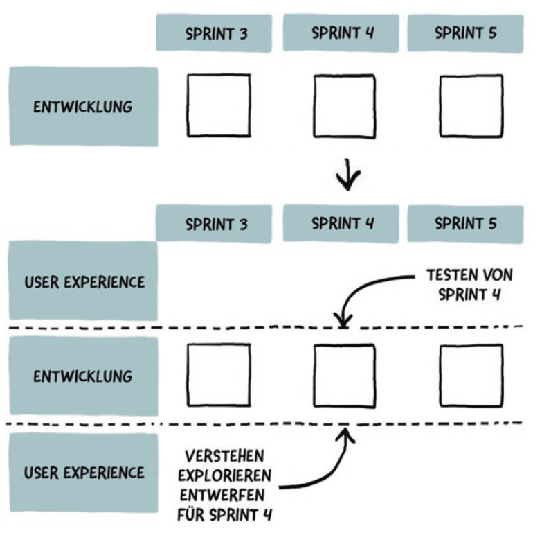

# UX Prozess und Lifecycle

## Ursprünge des User-Centered Design Prozess
Der User-Centered Design Prozess wurde erstmalig von Don Norman im Jahr 1981 im Rahmen einer Veröffentlichung in der Zeitschrift "Datamation" erwähnt.
In dieser Veröffentlichung thematisierte Don Norman die schlechte Nutzbarkeit von UNIX Benutzeroberflächen.
Don Norman thematisierte seine Anhaltspunkte im Buch "The Design of Everyday Things", bei welchem es darum geht wie Nutzer mit zehn tausenden Objekten im Alltag zurechtkommen.
Don Norman spricht sich zudem gegen traditionelle lineare Desigprozesse aus und befürwortet die Verwendung von **iterativen Prozessen**.

### User Centered Design Process

*User Centered Design Prozess*

## Beobachten und Verstehen
Das Ziel dieses Schrittes ist es, den **Nutzer**, dessen **Bedürfnisse** und den **Problemkontext** zu verstehen.
Hierzu sind folgende Aktivitäten notwendig:
* Contextual Inquiry
* Interviews
* Beobachtung
* Dairy Studies

## Bedürfnisse spezifizieren
Das Ziel dieses Schrittes ist es die **Bedürfnisse der Nutzer abzuleiten, zu dokumentieren und nutzbar zu machen**.
Hierzu sind folgende Aktivitäten notwendig:
* Affinity Diagram
* Kontext- und Nutzungsszenarien
* Personas

## Ideen entwickeln
Das Ziel dieses Schrittes ist es, **basierend auf den vorherigen Erkenntnissen** eine **Lösung für ein konkretes Problem / Bedürfniss zu entwickeln**.
Hierzu können folgende Aktivitäten angewendet werden:
* Kreativmethoden
* Sketching
* Szenarien

## Design
Hier sollen anschliessend die Ideen und Konzepte in ein **konzeptionelles Model** sowie ein **Interface basierend auf Interaktionsdesign, Informationsdesign sowie Visualdesign** überführt werden.
Folgende Aktivitäten können hierbei unterstützen:
* Cardsorting
* Informationsarchitektur
* Interatkionskonzept
* Moodboards
* Wireframes
* Flowdiagrams

## Prototyping
Hier soll das Design in **verschiedenen Varianten** in Form von **iteraktiv erfahrbaren Mockups und Prototypen** überführt werden.
Folgende Tätigkeiten können verwendet werden:
* Paper Prototypes
* Prototyping Tools
* Vertikale und Horizontale Prototypen in unterschiedlichen Ausprägungen

## Evaluation
Das erstellte Artefakt soll auf die **vorab definierten Ziele hin** überprüft werden.
Hierzu können folgende Evaluationsmethoden verwendet werden:
* Benutzerzentrierte Methode in Form eines **Usability Tests**
* Expertenorienterte Verfahren in Form einer **Heuristischen Evaluation**

## Prinzipien des User-Centered Designs
* Design basiert auf dem **expliziten** Verständnis von Benutzern, Aufgaben und Umgebung
* Nutzer werden in **Gestaltung und Entwicklung miteinbezogen**
* Design wird durch die **nutzerzentrierte Evaluation vorangetrieben und verfeinert**
* Prozess ist **iterativ**
* Der Entwurft **berücksichtigt die gesamte Nutzererfahrung**
* Designteam umfasst **multidisziplinäre Fähigkeiten und Perspektiven**

## Double Diamond
Das Double Diamond Modell wurde im Jahr 2004 entwickelt. Die Idee hinter dem Double Diamond Modell ist es, den Fokus bei den Schnittpunkten enger zu legen (sich auf bestimmte Aspekte zu fokussieren) und ansonsten den Fokus möglichst offen zu halten.

*Double Diamond*

## Google Design Sprint
Der Google Design Sprint wurde von **Google Ventures** entwickelt. Der Prozess beinhaltet insgesamt 5 Schritte und dauert 5 Tage. Im Gegensatz zu Design Thinking und UCD handelt es sich aber beim Design Sprint nicht um eine Denkhaltung oder oder eine Sammlung von Methoden, sondern ein in sich abgeschlossener Prozess.

*Google Design Sprint*

## Gemeinsamkeiten der  Desing Prozesse
Obwohl es viele verschiedene Design Prozesse wie Szenario-based Development, Lean UX oder die oben genannten Punkte gibt, haben diese doch viele Gemeinsamkeiten. Bei allen lassen sich folgende Schritte (manchmal in einer leicht abgewandelten Form) wiederfinden:
* Verstehen
* Spezifizieren
* Ideen generieren
* Gestalten
* Prototyping
* Testen

## UX Reifegradmodelle
UX Reifegradmodelle bieten eine Einschätzung hinsichtlich **der Ausprägung der nutzerzentrieten Kultur im Unternehmen**.
Eine Übersicht über weitere Reifegradmodelle ist unter folgendem [Link](https://nataliehanson.com/2017/02/13/ux-maturity-models/) verfügbar.

## UX Rollen
Innerhalb des UX Bereichs gibt es ebenfalls spezialisierte Rollen, welche hier kurz thematisiert werden.

### UX Designer
Die Aufgabe des UX Designers ist das **Entwerfen von benutzerfreundlichen Produkten, welche den Bedürfnissen der Endnutzer entspricht**. Der UX Designer verwendet hierbei bekannte Methoden wie Prototyping und Wireframing. Hierbei sind folgende Aktivitäten von zentraler Bedeutung:
* Explorieren
* Gestalten und Konzipieren
* Prototyping und Testobjekte erstellen
* Implementierungsvorlagen erstellen

### UX Researcher
Analysiert das Nutzerverhalten und bildet **datengestützte Erkentnnisse, um die Bedürfnisse der Nutzer anzusprechen**. Hierbei werden Methoden wie Usability Testing, Nutzerinterviews oder Customer Journeys verwendet. Die Tätigkeiten umfassen:
* Verstehen und Nutzerforschung
* Daten und Faktengrundlage schaffen
* Testen und UX Portfolio unterstützen

### UX Manager
UX Manger sind für ein Produkt oder für eine User-Experience Design-bezogene Aktivität zuständig. Hierbei fallen folgende Aktivitäten an:
* Reifegradbestimmung und Überwachung
* UX der Produkte und Services messen
* Allignment zwischen UX und Business
* UX-Transformationsprozesse
* Definition der UX-Design-Sprache und -Strategie einer Organisation

## UX Setups
Nebst den verschiedenen Rollen gibt es entsprechend auch verschiedene Konstellation (Setups).

### UX-Einzelkämpfer
Der UX-Einzelkämpfer übernimmt alle anfallenden UX Rollen. Dies ist oft in kleineren Unternehmen mit einem geringen UX-Reifegrad der fall.

### Zentrales UX-Team
Innerhalb eines UX-Teams arbeiten verschiedene Personen mit unterschiedlichen UX-Rollen zusammen. Dies ist mit **über 80% die häufigste Konstellation** und bietet folgende Vorteile:
* Guter inhaltlicher Austausch
* Teamleiter kann UX repräsentieren und vorantreiben

### UX im Projekt- oder Produktteam
Dies ist oft bei **agilen Setups wie SCRUM oder Kanban** der Fall und bietet folgende Vorteile:
* Expertise liegt auf einem Produkt (da pro Produkt ein entsprechendes UX Team vorhanden ist)
* Nähe zu Business und Entwicklung

## UX Integration bei agilen Setups
Oft ist es nicht einfach den UCD-Prozess in bereits bestehende agile Setups zu intergrieren, doch auch hier gibt es verschiedene Lösungswege.

### UX in einem parallelen UX-Strang
* Startet ein Projekt neu wird im Rahmen des "Sprint 0" entsprechend User Research betrieben und ein Grobdesign erstellt
* Der Ablauf orientiert sich an der Sprintplanung, wobei jeweils dass im vorherigen Sprint erstellte Artefakt geprüft wird.

*Paralleler UX-Strang*
